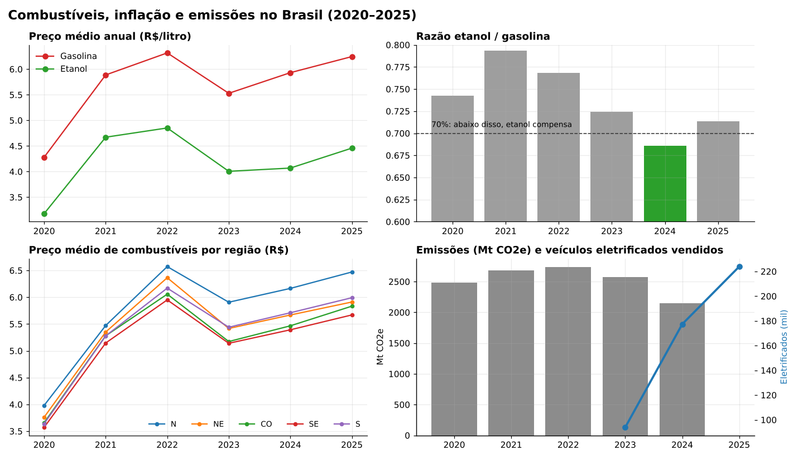

# Dashboard de Combustíveis no Brasil: preços, inflação e emissões (2020–2025)

Painel interativo em **Python + Streamlit** que cruza dados públicos de preços de combustíveis, inflação, emissões de gases de efeito estufa e venda de veículos eletrificados no Brasil, para responder perguntas como:

- O preço dos combustíveis subiu mais ou menos que a inflação?
- Em quais anos, regiões e municípios **compensa abastecer com etanol**?
- Quais estados e regiões pagam mais caro?
- As emissões estão caindo enquanto a venda de carros elétricos cresce?



## O que o painel mostra

O dashboard é dividido em 6 abas:

| Aba | Conteúdo |
|---|---|
| **1. Resumo** | Indicadores-chave: razão etanol/gasolina, % de municípios onde o etanol compensa, IPCA médio do período e evolução dos preços |
| **2. Mercado** | Preço médio por produto (gasolina, etanol, diesel, GNV…) e competitividade do etanol |
| **3. Inflação** | Variação dos combustíveis comparada ao IPCA e aos grupos de despesa do IBGE |
| **4. Vendas ANP** | Volume vendido de combustíveis (requer o arquivo de vendas da ANP, que pode ser enviado pela própria tela) |
| **5. Emissões e transição** | Emissões de CO2e e crescimento da venda de veículos eletrificados |
| **6. Regiões e ranking** | Comparação entre regiões e estados mais caros e mais baratos |

**Destaques da análise**

- O etanol só ficou abaixo da faixa de 70% do preço da gasolina, quando costuma valer a pena, em **2024** (razão de 0,686). Em 2025 voltou para 0,714.
- A região **Norte** tem o combustível mais caro em todos os anos analisados, e o **Sudeste**, o mais barato.
- A venda de veículos eletrificados passou de cerca de **94 mil (2023) para 224 mil (2025)**.

## Fontes de dados

| Dado | Fonte |
|---|---|
| Preços de revenda de combustíveis | ANP: Levantamento de Preços de Combustíveis |
| IPCA anual e por grupos | IBGE (SIDRA) |
| Emissões de CO2e | SEEG (Sistema de Estimativas de Emissões de Gases de Efeito Estufa) |
| Venda de veículos eletrificados | ABVE (Associação Brasileira do Veículo Elétrico) |

Os dados brutos foram tratados e agregados em arquivos `.parquet` leves, que ficam na pasta `outputs/`. Assim, o dashboard abre rápido e sem precisar baixar gigabytes de dados.

## Como rodar

```bash
git clone https://github.com/brnsar/dashboard-combustiveis-brasil.git
cd dashboard-combustiveis-brasil
pip install -r requirements.txt
streamlit run dashboard_combustiveis_co2.py
```

O painel abre em `http://localhost:8501`.

Outra opção é abrir o repositório no **GitHub Codespaces**: o ambiente já vem configurado em `.devcontainer/` e o dashboard sobe sozinho.

## Estrutura do projeto

```
├── dashboard_combustiveis_co2.py      # Aplicação Streamlit (painel principal)
├── analise_exploratoria_automotivos.py # Análise exploratória e geração de gráficos/relatório
├── export_dashboard_html.py            # Exporta uma versão estática do painel em HTML
├── outputs/                            # Dados tratados (.parquet) usados pelo painel
├── docs/                               # Imagens do README
├── .devcontainer/                      # Configuração do Codespaces
└── requirements.txt
```

> **Observação:** os scripts `analise_exploratoria_automotivos.py` e `export_dashboard_html.py` dependem das bases brutas da ANP (o consolidado de preços e a série de vendas), que não estão no repositório por causa do tamanho. O dashboard principal funciona sem elas.

## Tecnologias

Python · Streamlit · Pandas · Plotly · PyArrow · Statsmodels · Matplotlib

## Autora

**Bruna Soares**: [brnsar6@gmail.com](mailto:brnsar6@gmail.com)
